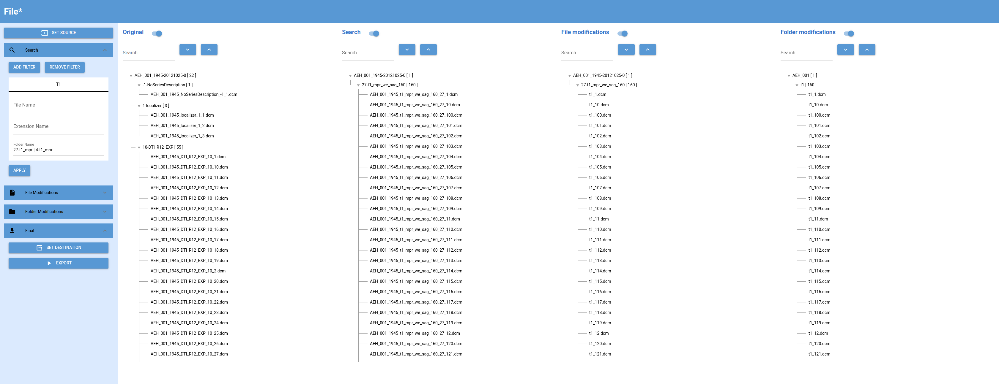

# File*

[](LICENSE)




## Description

File* is a file management tool that allows you to organize and clean your file structure. 
Individual filter rules can be defined to find files and folders.
The filter rules can be combined with logical operators (AND, OR, NOT).
File names and folder names can be changed per filter and are viualized in a preview.

## Installation

Explain how to install your project, including any prerequisites or dependencies.

```bash
$ git clone https://github.com/melandur/generic_file_cleaner.git
$ cd generic_file_cleaner

$ pip install -r requirements.txt
$ or
$ poetry install

$ python main.py
```


